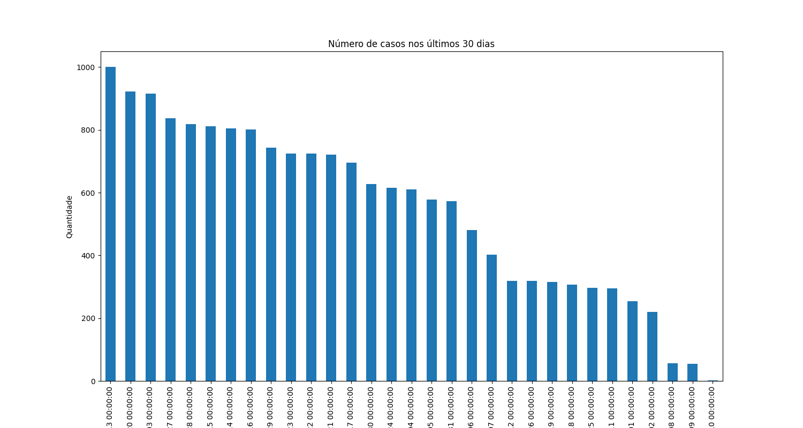
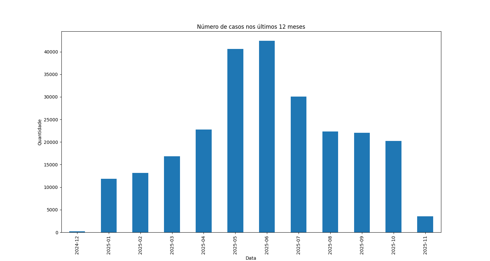

```markdown
# Evolução da Tuberculose Atualmente

## Análise

A tuberculose (TB) continua a ser um grave problema de saúde pública em várias partes do mundo, apesar dos avanços no diagnóstico e tratamento. A evolução da tuberculose nos últimos anos é marcada por uma série de fatores, incluindo a resistência a medicamentos, a coinfecção com HIV e as desigualdades no acesso à saúde.

### Taxas e Métricas Relacionadas à Tuberculose

Para entender a evolução da tuberculose, é importante considerar algumas métricas relevantes:

- **Taxa de Aumento de Casos**: A taxa de aumento de casos de tuberculose pode variar de região para região, mas globalmente, a Organização Mundial da Saúde (OMS) estima que cerca de 10 milhões de pessoas foram infectadas em 2020, com uma taxa de aumento em algumas áreas endêmicas.

- **Taxa de Mortalidade**: A taxa de mortalidade global por tuberculose foi de aproximadamente 1,5 milhões de mortes em 2020, o que representa uma taxa de mortalidade significativa, especialmente em países de baixa e média renda.

- **Taxa de Ocupação de UTI**: Embora a tuberculose não exija frequentemente internação em UTI, casos graves podem ocorrer, especialmente em pacientes com formas resistentes da doença, levando a uma ocupação maior em ambientes hospitalares.

- **Taxa de Vacinação da População**: A vacinação com BCG (Bacilo de Calmette-Guérin) é uma medida preventiva importante, mas a cobertura vacinal varia muito. Em países em desenvolvimento, a taxa de vacinação pode ser alta, enquanto em países desenvolvidos, a taxa pode ser baixa, dado que a tuberculose é menos prevalente.

### Fatores de Risco

Os principais fatores de risco para a tuberculose incluem:

- **Imunossupressão**: Pacientes com HIV/AIDS, diabetes ou outras condições que comprometem o sistema imunológico.
- **Desnutrição**: A falta de nutrientes essenciais pode aumentar a vulnerabilidade à infecção.
- **Ambientes Superlotados**: A tuberculose é uma doença transmitida pelo ar, e ambientes densamente povoados facilitam a propagação.
- **Acesso Limitado à Saúde**: A falta de serviços de saúde adequados para diagnóstico e tratamento.

### Medidas Preventivas

As medidas preventivas incluem:

- **Vacinação**: A vacinação com BCG é uma das principais estratégias de prevenção.
- **Detecção Precoce**: Testes rápidos e eficazes para diagnóstico de TB.
- **Tratamento Adequado**: Iniciar o tratamento o mais rápido possível para reduzir a transmissão.
- **Educação em Saúde**: Informar a população sobre os sintomas e a importância do tratamento.

## Recomendações de Saúde Pública

- **Fortalecimento dos Sistemas de Saúde**: Investir em infraestrutura de saúde para garantir acesso ao diagnóstico e tratamento.
- **Campanhas de Conscientização**: Promover campanhas educativas sobre a tuberculose e seus fatores de risco.
- **Monitoramento e Vigilância**: Estabelecer sistemas de monitoramento para rastrear a incidência e a resistência a medicamentos.
- **Integração com Programas de HIV**: Abordar a coinfecção TB/HIV de forma integrada.

## Conclusão

A tuberculose permanece uma preocupação significativa de saúde pública global. A combinação de estratégias de prevenção, diagnóstico precoce e tratamento adequado é crucial para controlar a disseminação da doença e reduzir as taxas de mortalidade. O envolvimento da comunidade e a colaboração entre diferentes setores são essenciais para enfrentar esse desafio.

```


## Dados das métricas

uso antiviral: 17.314736320158673
casos de contato com aves e suinos: 1.8437473529660897
casos de febre: 66.69064748201438
casos de dispneia: 73.23638265165825
Propoporção de pessosas em fator de risco: 100.0
Proporção de pessoas vacinadas: 29.96030578575987
Proporção de pacientes na UTI: 31.833432469608535
evolução da doença: 8.919784732067955
casos de surto sg: 6.055365458970019


## Gráficos da evolução nos últimos 30 dias




## Gráficos da evolução nos últimos 12 meses



