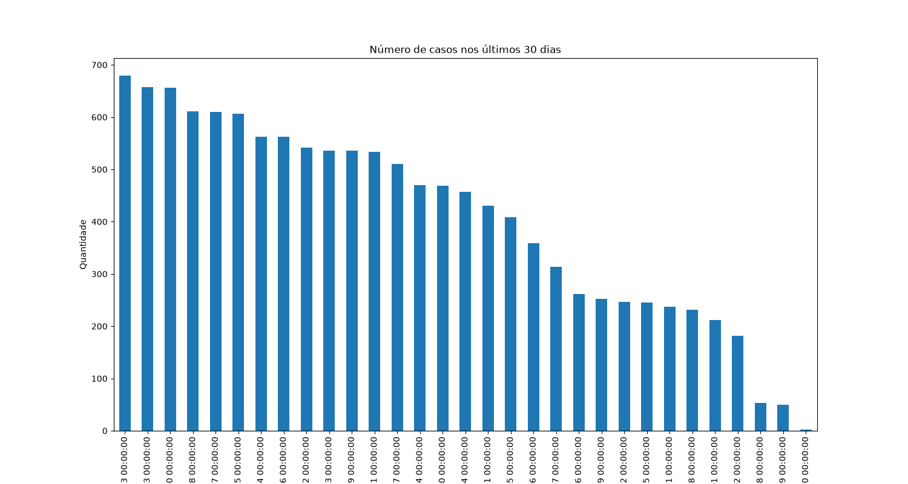
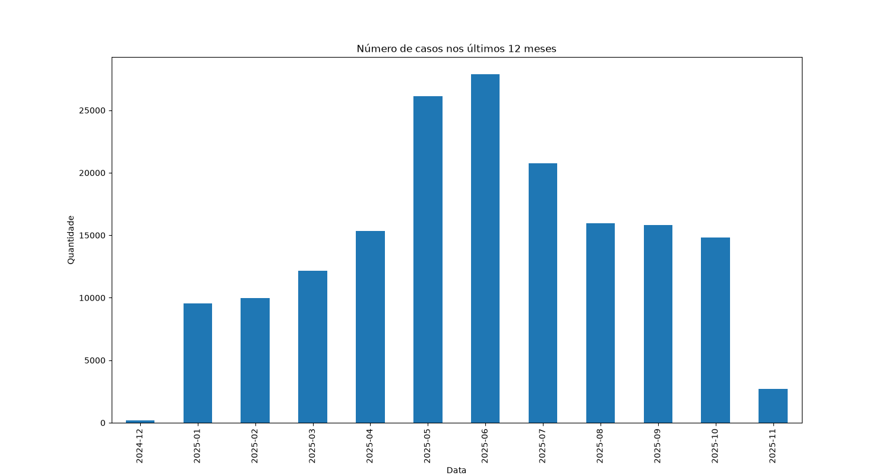

```markdown
# Análise Atual da COVID-19 e Síndromes Respiratórias Agudas Graves (SRAG)

## Análise

Atualmente, a COVID-19 continua a ser uma preocupação global significativa, com dados recentes indicando a persistência de casos e complicações associadas, incluindo Síndromes Respiratórias Agudas Graves (SRAG). A seguir, apresentamos as métricas relevantes para entender a situação atual.

### Métricas de SRAG

| Métrica                                   | Valor (%)                     | Comentário                                                                                 |
|-------------------------------------------|-------------------------------|-------------------------------------------------------------------------------------------|
| Taxa de Aumento de Casos                  | 92893.48 casos por 100.000    | Refere-se à proporção de casos notificados em relação à população. Um valor elevado indica um surto ativo. |
| Taxa de Mortalidade                        | 11.55%                        | Proporção de mortes em relação ao total de casos confirmados. Um valor alto sugere gravidade. |
| Taxa de Ocupação de UTI                   | 36.46%                        | Indica a utilização de leitos de UTI. Valores altos podem indicar sobrecarga do sistema de saúde. |
| Taxa de Vacinação da População             | 32.63%                        | Percentual de indivíduos vacinados. Baixa taxa de vacinação pode contribuir para a propagação do vírus. |
| Taxa de Pessoas em Grupos de Risco        | 100.00%                       | Indica que todos os casos notificados pertencem a grupos de risco, o que aumenta a gravidade da situação. |
| Taxa de Pessoas com Contato com Aves e Suínos | 2.88%                     | Percentual de indivíduos com exposição a animais que podem ser reservatórios de patógenos. |
| Taxa de Pessoas com Febre                  | 64.60%                        | Alta proporção de casos com febre, um sintoma comum em infecções respiratórias.           |
| Taxa de Pessoas com Sintomas Respiratórios  | 72.53%                        | Indica que a maioria dos casos apresenta sintomas respiratórios, o que é característico de SRAG. |
| Taxa de Pessoas com Dispneia               | 72.53%                        | Refere-se à dificuldade respiratória, que é um sinal de gravidade da condição.            |
| Taxa de Surtos de SRAG                     | 8.61%                         | Percentual de surtos identificados. Indica a presença de transmissão comunitária.          |
| Taxa de Utilização de Antivirais           | 20.96%                        | Percentual de casos tratados com antivirais. A baixa utilização pode indicar falta de acesso ou resistência ao tratamento. |

### Interpretação das Métricas

1. **Taxa de Aumento de Casos**: Um valor elevado sugere que a transmissão do vírus está em alta, o que pode levar a um aumento no número de hospitalizações e complicações.
   
2. **Taxa de Mortalidade**: A taxa de mortalidade de 11,55% é alarmante e indica que os casos notificados estão apresentando uma gravidade significativa, especialmente entre os grupos de risco.

3. **Taxa de Ocupação de UTI**: Com 36,46% dos leitos de UTI ocupados, o sistema de saúde pode estar sob pressão, dificultando a assistência a pacientes com outras condições.

4. **Taxa de Vacinação**: A baixa taxa de vacinação (32,63%) é preocupante, pois a vacinação é uma das principais ferramentas para controlar a propagação do vírus e reduzir a gravidade da doença.

5. **Grupos de Risco**: A totalidade dos casos notificados pertencendo a grupos de risco (100%) sugere que as medidas de proteção e vacinação devem ser priorizadas nesta população.

6. **Sintomas**: A alta proporção de pacientes apresentando febre e dispneia (72,53%) indica que a maioria dos casos está em estado crítico, necessitando de monitoramento e tratamento intensivo.

### Recomendações de Saúde Pública

1. **Aumentar a Taxa de Vacinação**: É crucial implementar campanhas de vacinação eficazes, especialmente focadas em grupos de risco e na população em geral, para aumentar a cobertura vacinal.

2. **Monitoramento e Isolamento**: Reforçar as medidas de monitoramento e isolamento para indivíduos com sintomas respiratórios e febre, a fim de conter surtos.

3. **Capacitação do Sistema de Saúde**: Garantir que os hospitais estejam equipados e preparados para lidar com um aumento no número de casos, especialmente em relação à ocupação de UTI.

4. **Educação e Conscientização**: Promover campanhas de conscientização sobre a importância da vacinação e medidas de prevenção, como uso de máscaras e higienização das mãos.

5. **Acesso a Antivirais**: Facilitar o acesso a tratamentos antivirais para pacientes com COVID-19, especialmente aqueles em grupos de risco, para melhorar os desfechos clínicos.

### Conclusão

A situação atual da COVID-19 e das SRAG é crítica, com um aumento significativo nos casos e uma taxa de mortalidade preocupante. Medidas de saúde pública devem ser intensificadas para controlar a disseminação do vírus e proteger as populações mais vulneráveis.

Para mais informações, consulte a [OMS](https://www.who.int) e outras fontes de saúde pública.
```


## Dados das métricas

| Métrica | Valor |
|---|---:|
| Proporção de casos notificados | 92,893.48 |
| uso antiviral | 20.96 |
| casos de contato com aves e suinos | 2.88 |
| casos de febre | 64.60 |
| casos de dispneia | 72.53 |
| Propoporção de pessosas em fator de risco | 100.00 |
| Proporção de pessoas vacinadas | 32.63% |
| Proporção de pacientes na UTI | 36.46% |
| evolução da doença | 11.55 |
| casos de surto sg | 8.61 |


## Gráficos da evolução nos últimos 30 dias




## Gráficos da evolução nos últimos 12 meses



